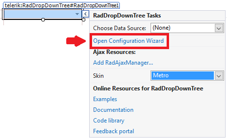
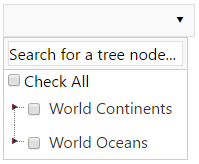
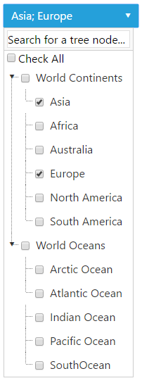

# Getting Started


This article will get you started in using the **RadDropDownTree** control. It contains the following sections:


* [Creating a Simple RadDropDownTree](#creating-a-simple-raddropdowntree)

* [Configure the RadDropDownTree using the Configuration wizard](#configure-the-raddropdowntree-using-the-configuration-wizard)

* [Populate RadDropDownTree with simple data in the code-behind](#populate-raddropdowntree-with-simple-data-in-the-code-behind)


## Creating a Simple RadDropDownTree

1. In a new AJAX Enabled Web Application, drop a **RadDropDownTree** to the default form.

1. Open the Smart Tag and set the **Skin** to **Metro** from the drop down list. Then select the **Open Configuration Wizard** link. *This step will display the RadDropDownTree Configuration Wizard window.*
>caption 



## Configure the RadDropDownTree using the Configuration Wizard

1. On the Configuration Wizard General tab check **ExpandOnSingleClick** checkbox. From the **CheckBoxes** drop-down choose **SingleCheck**:
>caption 


1. On the DropDownSettings tab check **OpenDropDownOnLoad** checkbox:
>caption 


1. On the Filtering Settings tab check **EnableFiltering** checkbox. Type in the **EmptyMessage** TextBox **Search for a tree node...**:
>caption 


1. On the Button Settings tab check **ShowCheckAll** checkbox:
>caption 


1. Click Apply and then OK.

Switch from Designer to Source view. The generated markup for the RadDropDownTree should look like the following:

````ASP.NET

<telerik:RadDropDownTree ID="RadDropDownTree1" 
    runat="server" 
    CheckBoxes="SingleCheck" 
    EnableFiltering="True" 
    ExpandNodeOnSingleClick="True" 
    Skin="Metro">
    <DropDownSettings AutoWidth="Enabled" 
        OpenDropDownOnLoad="True" />
    <ButtonSettings ShowCheckAll="True" />
    <FilterSettings Highlight="None" 
        EmptyMessage="Search for a tree node..."></FilterSettings>
</telerik:RadDropDownTree>

````


## Populate RadDropDownTree with simple data in the code-behind

In code-behind you could populate the newly created RadDropDownTree with data in the Page_Load() method:

````C#

protected void Page_Load(object sender, EventArgs e)
{
    if (!IsPostBack)
    {
        RadDropDownTree1.DataFieldID = "ID";
        RadDropDownTree1.DataFieldParentID = "ParentID";
        RadDropDownTree1.DataValueField = "Value";
        RadDropDownTree1.DataTextField = "Text";
        RadDropDownTree1.DataSource = GetData();
        RadDropDownTree1.DataBind();
    }
}

public DataTable GetData()
{
    DataTable table = new DataTable();
    table.Columns.Add("ID");
    table.Columns.Add("ParentID");
    table.Columns.Add("Value");
    table.Columns.Add("Text");

    table.Rows.Add(new String[] { "1", null, "World_Continents", "World Continents" });
    table.Rows.Add(new String[] { "2", null, "World_Oceans", "World Oceans" });

    table.Rows.Add(new String[] { "3", "1", "Asia", "Asia" });
    table.Rows.Add(new String[] { "4", "1", "Africa", "Africa" });
    table.Rows.Add(new String[] { "5", "1", "Australia", "Australia" });
    table.Rows.Add(new String[] { "6", "1", "Europe", "Europe" });
    table.Rows.Add(new String[] { "7", "1", "North_America", "North America" });
    table.Rows.Add(new String[] { "8", "1", "South_America", "South America" });

    table.Rows.Add(new String[] { "9", "2", "Arctic_Ocean", "Arctic Ocean" });
    table.Rows.Add(new String[] { "10", "2", "Atlantic_Ocean", "Atlantic Ocean" });
    table.Rows.Add(new String[] { "11", "2", "Indian_Ocean", "Indian Ocean" });
    table.Rows.Add(new String[] { "12", "2", "Pacific_Ocean", "Pacific Ocean" });
    table.Rows.Add(new String[] { "13", "2", "South_Ocean", "SouthOcean" });

    return table;
}     
	
````
````VB

Protected Sub Page_Load(sender As Object, e As EventArgs)
	If Not IsPostBack Then
		RadDropDownTree1.DataFieldID = "ID"
		RadDropDownTree1.DataFieldParentID = "ParentID"
		RadDropDownTree1.DataValueField = "Value"
		RadDropDownTree1.DataTextField = "Text"
		RadDropDownTree1.DataSource = GetData()
		RadDropDownTree1.DataBind()
	End If
End Sub

Public Function GetData() As DataTable
	Dim table As New DataTable()
	table.Columns.Add("ID")
	table.Columns.Add("ParentID")
	table.Columns.Add("Value")
	table.Columns.Add("Text")

	table.Rows.Add(New [String]() {"1", Nothing, "World_Continents", "World Continents"})
	table.Rows.Add(New [String]() {"2", Nothing, "World_Oceans", "World Oceans"})

	table.Rows.Add(New [String]() {"3", "1", "Asia", "Asia"})
	table.Rows.Add(New [String]() {"4", "1", "Africa", "Africa"})
	table.Rows.Add(New [String]() {"5", "1", "Australia", "Australia"})
	table.Rows.Add(New [String]() {"6", "1", "Europe", "Europe"})
	table.Rows.Add(New [String]() {"7", "1", "North_America", "North America"})
	table.Rows.Add(New [String]() {"8", "1", "South_America", "South America"})

	table.Rows.Add(New [String]() {"9", "2", "Arctic_Ocean", "Arctic Ocean"})
	table.Rows.Add(New [String]() {"10", "2", "Atlantic_Ocean", "Atlantic Ocean"})
	table.Rows.Add(New [String]() {"11", "2", "Indian_Ocean", "Indian Ocean"})
	table.Rows.Add(New [String]() {"12", "2", "Pacific_Ocean", "Pacific Ocean"})
	table.Rows.Add(New [String]() {"13", "2", "South_Ocean", "SouthOcean"})

	Return table
End Function

````

On the initial load of the page you will see the RadDropDownTree:



After expanding all collapsed nodes your RadDropDownTree should look like:




# See Also

 * [Overview]()
